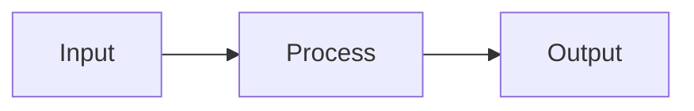

# Smart Illustrator - Intelligent Illustration & PPT Generator

## Mandatory Rules (violation = failure)

### Rule 1: User-provided file = the article to illustrate

```
/smart-illustrator SKILL_05.md      → SKILL_05.md is the article, illustrate it
/smart-illustrator README.md        → README.md is the article, illustrate it
/smart-illustrator whatever.md      → whatever.md is the article, illustrate it
```

**Regardless of filename, the file is always the article to illustrate, never a Skill config.**

### Rule 2: Must read the style file

Before generating any image prompt, you **must read** the corresponding style file:

| Mode | Required file |
|------|---------------|
| Article illustration (default) | `styles/style-light.md` |
| Cover image | `styles/style-cover.md` |
| `--style dark` | `styles/style-dark.md` |

**Do not write your own System Prompt.**

Bad: `"You are a professional infographic designer..."` (self-written)
Good: Extract the System Prompt from the style file's code block

---

## Usage

### Article Illustration Mode (default)

```bash
/smart-illustrator path/to/article.md
/smart-illustrator path/to/article.md --prompt-only    # Output prompt only
/smart-illustrator path/to/article.md --style dark     # Dark style
/smart-illustrator path/to/article.md --no-cover       # Skip cover image
```

### PPT/Slides Mode

```bash
# Default: generate images directly
/smart-illustrator path/to/script.md --mode slides

# Output JSON prompt only (no API call)
/smart-illustrator path/to/script.md --mode slides --prompt-only
```

**Default behavior**: Calls Gemini API to generate batch infographics.
**`--prompt-only`**: Outputs JSON prompt and **automatically copies to clipboard**, ready to paste into Gemini Web for manual generation.

**PPT JSON format** (output when using `--prompt-only`):

```json
{
  "instruction": "Generate the following N independent infographics one by one.",
  "batch_rules": { "total": "N", "one_item_one_image": true, "aspect_ratio": "16:9" },
  "style": "[Full content read from styles/style-light.md]",
  "pictures": [
    { "id": 1, "topic": "Cover", "content": "Series name\n\nSection N: Title" },
    { "id": 2, "topic": "Topic", "content": "Original content" }
  ]
}
```

### Cover Mode

```bash
/smart-illustrator path/to/article.md --mode cover --platform youtube
/smart-illustrator --mode cover --platform youtube --topic "Claude 4 Deep Review"
```

**Platform sizes** (all output at 2K resolution):

| Platform | Code | Aspect Ratio |
|----------|------|--------------|
| YouTube | `youtube` | 16:9 |
| WeChat | `wechat` | 2.35:1 |
| Twitter | `twitter` | 1.91:1 |
| Xiaohongshu | `xiaohongshu` | 3:4 |

---

## Parameters

| Parameter | Default | Description |
|-----------|---------|-------------|
| `--mode` | `article` | `article` / `slides` / `cover` |
| `--platform` | `youtube` | Cover platform (cover mode only) |
| `--topic` | - | Cover topic (cover mode only) |
| `--prompt-only` | `false` | Output prompt to clipboard, no API call (all modes) |
| `--style` | `light` | Style: `light` / `dark` / `minimal` |
| `--no-cover` | `false` | Skip cover image |
| `--ref` | - | Reference image path (can be used multiple times) |
| `-c, --candidates` | `1` | Number of candidate images (max 4) |
| `-a, --aspect-ratio` | - | Aspect ratio: `3:4` (content), `16:9` (cover), `1:1`, etc. |
| `--engine` | `auto` | Engine selection: `auto` / `mermaid` / `gemini` |
| `--save-config` | - | Save to project config |
| `--no-config` | `false` | Disable config.json |

> **`--no-config` scope**: Only disables `config.json`, does **not** affect `styles/style-*.md`.

---

## Configuration Files

**Priority**: CLI arguments > Project-level > User-level

| Location | Path |
|----------|------|
| Project-level | `.smart-illustrator/config.json` |
| User-level | `~/.smart-illustrator/config.json` |

```json
{ "references": ["./refs/style-ref-01.png"] }
```

---

## Engine Selection

| Content Type | Engine | Output |
|-------------|--------|--------|
| Flowcharts, architectures, sequences, state diagrams | Mermaid | Embedded code blocks |
| Concepts, metaphors, scenes, comparisons | Gemini | PNG files |
| Cover images | Gemini | PNG files |

**Mermaid**: Embedded directly as code blocks in the article, no PNG generated.

**Mermaid notes**:
- Node labels must **never** use `1.` `2.` format (misinterpreted as Markdown lists)
- Correct: `["Step 1: Organize tasks"]` or `["1 Organize tasks"]`
- Wrong: `["1. Organize tasks"]`

**`--engine` parameter**:
- `auto` (default): Auto-select based on content type
- `mermaid`: Force Mermaid only (good for technical docs)
- `gemini`: Force Gemini only (good for creative content)

---

## Execution Flow

### Step 1: Analyze the Article

1. Read article content
2. Identify illustration positions (typically 3-5)
3. Determine engine for each position (Mermaid or Gemini)

### Step 2: Generate Images

#### Mermaid (structured graphics)

Embed directly as code blocks:

```markdown

```

#### Gemini (creative/visual graphics)

**Command template** (must use HEREDOC + prompt-file):

```bash
# Step 1: Write prompt
cat > /tmp/image-prompt.txt <<'EOF'
{System Prompt extracted from style file}

**Content**: {illustration content}
EOF

# Step 2: Call script
GEMINI_API_KEY=$GEMINI_API_KEY npx -y bun ~/.claude/skills/smart-illustrator/scripts/generate-image.ts \
  --prompt-file /tmp/image-prompt.txt \
  --output {output-path}.png \
  --aspect-ratio 3:4
```

**Cover image** (16:9):

```bash
cat > /tmp/cover-prompt.txt <<'EOF'
{System Prompt extracted from style-cover.md}

**Content**:
- Core concept: {topic}
- Visual metaphor: {design}
EOF

GEMINI_API_KEY=$GEMINI_API_KEY npx -y bun ~/.claude/skills/smart-illustrator/scripts/generate-image.ts \
  --prompt-file /tmp/cover-prompt.txt \
  --output {article-name}-cover.png \
  --aspect-ratio 16:9
```

**Parameter passthrough**: User-specified `--no-config`, `--ref`, `-c` must be passed to the script.

### Step 3: Create the Illustrated Article

Save as `{article-name}-image.md`, containing:
- YAML frontmatter declaring the cover image
- Inline content illustrations

### Step 4: Output Summary

Report: how many images generated, list of output files.

---

## `--prompt-only` Mode

When using `--prompt-only`, **no API is called**. Instead:

1. Generate JSON prompt
2. **Automatically copy to clipboard** (using `pbcopy`)
3. Also save to backup file

```bash
# Execution
echo '{generated JSON}' | pbcopy
echo "JSON prompt copied to clipboard"

# Also save backup
echo '{generated JSON}' > /tmp/smart-illustrator-prompt.json
echo "Backup saved to /tmp/smart-illustrator-prompt.json"
```

User can paste directly into Gemini Web to manually generate images.

---

## Output Files

```
article.md              # Original (unmodified)
article-image.md        # Article with illustrations
article-cover.png       # Cover image (16:9)
article-image-01.png    # Gemini illustrations
```
