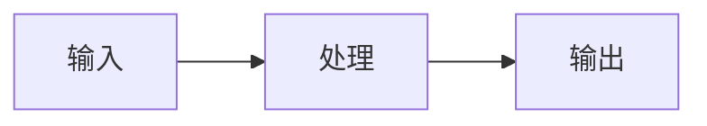
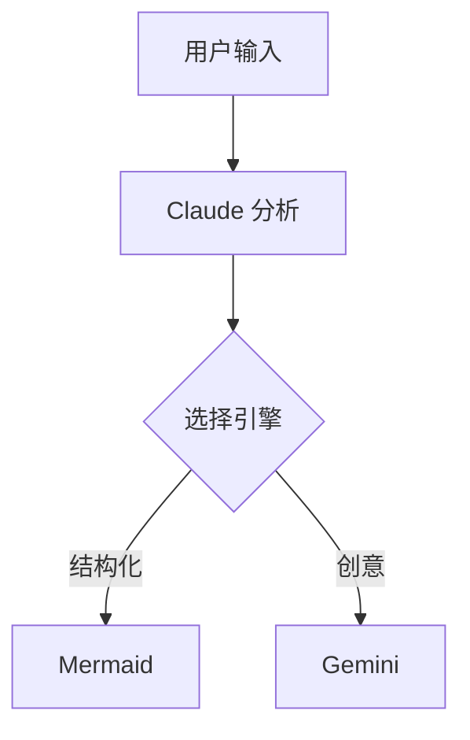

# Smart Illustrator - 智能配图与 PPT 生成器

支持四种模式：
1. **文章配图模式**（默认）：为文章生成插图
2. **PPT/Slides 模式**：将内容转化为批量信息图 JSON prompt
3. **Match 模式**：从已有图片中挑选合适的配图插入文章
4. **Cover 模式**（新）：生成高点击率的 YouTube/公众号封面图

## 使用方式

### 文章配图模式（默认）

```bash
# 分析文章并自动生成配图
/smart-illustrator path/to/article.md

# 只输出 prompt，不自动生成图片
/smart-illustrator path/to/article.md --prompt-only

# 指定风格
/smart-illustrator path/to/article.md --style light     # 浅色清爽（默认）
/smart-illustrator path/to/article.md --style dark      # 深色科技

# 不生成封面图
/smart-illustrator path/to/article.md --no-cover
```

### PPT/Slides 模式

```bash
# 生成 PPT 信息图 JSON prompt
/smart-illustrator path/to/script.md --mode slides

# 或直接说"生成PPT"、"生成幻灯片"
请使用 smart-illustrator 为 xxx.md 生成 PPT
```

**PPT 模式输出**：JSON 格式的 prompt 文件，可直接复制到 Gemini 生成批量信息图。

**PPT 模式规则**：
- 按信息密度和重要性分割内容（不是机械按 H2 标题）
- 金句/重点：哪怕内容少也单独一张
- 并列内容：合并成一张（如"价值1、2、3"→ 一张图）
- 使用 `topic` + `content` 结构，让 Gemini 自由设计标题和构图
- **不要**指定 `visual_suggestion` 或构图建议
- 完整传递 style prompt，不要简化

**封面图特殊规则**（picture_1）：
- 封面需要体现课程系列的品牌一致性
- 如果用户提供了课程系列名称，封面 content 必须包含完整的层级结构：
  - **系列名称**：如 "Agent Skills 完全指南"
  - **章节序号**：如 "第4节"
  - **章节标题**：如 "渐进式披露与 Description 优化"
- 格式示例：`"content": "Agent Skills 完全指南\n\n第4节：渐进式披露与 Description 优化\n\n学习目标：..."`
- 如果用户没有指定系列名称，**主动询问**是否需要添加系列品牌

**PPT 模式 JSON 格式（必须严格遵守）**：

```json
{
  "instruction": "请逐条生成以下 N 张独立信息图。每个 picture 对应 1 张图，严禁合并。",
  "batch_rules": {
    "total": "N（实际图片数量）",
    "one_item_one_image": true,
    "aspect_ratio": "16:9",
    "do_not_merge": true
  },
  "fallback": "如果无法一次生成全部图片：请输出 N 条独立的单图绘图指令（编号 1-N），每条可单独执行，必须包含完整 style 和水印要求。",
  "style": "[从 styles/style-light.md 读取完整内容，原样放入]",
  "pictures": [
    {
      "id": 1,
      "topic": "封面",
      "content": "系列名称\n\n第N节：章节标题\n\n学习目标：..."
    },
    {
      "id": 2,
      "topic": "主题方向（不是最终标题，Gemini 自行设计标题）",
      "content": "原始内容（不要提炼摘要，保留完整信息）"
    }
  ]
}
```

**格式要点**：
- 使用 `pictures` 数组 + `id` 字段（数组结构让模型更容易进入"逐条执行"模式）
- `instruction` 放最前面，用自然语言明确"逐条生成"
- `batch_rules` 用机器可读格式强调批处理规则
- `fallback` 提供降级策略：如果无法批量生成，输出可单独执行的指令
- **不要**添加 `metadata`、`visual_suggestion` 等额外字段
- `style` 字段必须包含完整的 style prompt（从 styles/ 目录读取）
- `topic` 只是主题方向，Gemini 根据 content 自行设计图片标题
- `content` 保留原始内容，不要提炼成摘要

**⚠️ 生成 JSON 前必须执行**：
1. 先读取 `references/slides-prompt-example.json` 作为格式参考
2. 严格按照示例的结构生成，不要自创格式
3. 从 `styles/style-light.md` 读取完整 style 内容放入 JSON

### Match 模式（图片复用）

从已有图片中挑选合适的配图插入文章，无需重新生成。适用于：
- PPT 模式生成的图片复用到文章
- 已有图片素材库的匹配

```bash
# 从图片目录中匹配
/smart-illustrator path/to/article.md --mode match --images path/to/images/

# 或直接说"匹配图片"、"挑选配图"
请从 images/ 目录中挑选合适的图片为 article.md 配图
```

**Match 模式工作流程**：
1. 读取文章内容，分析结构，识别配图位置
2. 读取 `--images` 指定的目录/文件中的所有图片
3. **Claude 使用视觉能力理解每张图片的内容主题**
4. 根据内容相关性匹配：文章段落 ↔ 图片
5. 输出带配图引用的 `{文章名}-image.md`

**Match 模式规则**：
- 不是每张图都要用，只挑选最匹配的
- 不是每个段落都要配图，只在需要的位置插入
- 如果没有合适的图片匹配某个位置，跳过该位置
- 输出时说明每张图被匹配到的位置和理由

### Cover 模式（封面图生成）

专为 YouTube 缩略图、公众号封面等设计的高点击率封面图生成器。

```bash
# 为文章生成 YouTube 封面
/smart-illustrator path/to/article.md --mode cover --platform youtube

# 指定主题直接生成
/smart-illustrator --mode cover --platform youtube --topic "Claude 4 深度评测"

# 指定描述生成
/smart-illustrator --mode cover --platform wechat --description "震惊表情 + AI 工具对比"

# 或直接说"生成封面"、"做个缩略图"
请为 xxx.md 生成一张 YouTube 封面图
```

**支持的平台尺寸**：

| 平台 | 代码 | 尺寸 | 比例 |
|------|------|------|------|
| YouTube | `youtube` | 1280×720 | 16:9 |
| 公众号 | `wechat` | 900×383 | 2.35:1 |
| Twitter | `twitter` | 1200×628 | 1.91:1 |
| 小红书 | `xiaohongshu` | 1080×1440 | 3:4 |
| 通用横版 | `landscape` | 1920×1080 | 16:9 |
| 通用方形 | `square` | 1080×1080 | 1:1 |

**Cover 模式设计原则**（详见 `references/cover-best-practices.md`）：
1. **3 秒法则**：瞬间传达主题和价值
2. **高对比**：深色背景 + 亮色主体
3. **单一焦点**：只有一个视觉中心
4. **文字精简**：3-6 字，粗体无衬线
5. **好奇心缺口**：让人想点击

**Cover 模式工作流程**：
1. 如果提供文章路径：分析标题和内容，提取核心概念
2. 根据平台选择对应尺寸
3. 加载 `styles/style-cover.md` 样式
4. 生成封面图并保存为 `{文章名}-cover-{platform}.png`

### 参数说明

| 参数 | 默认值 | 说明 |
|------|--------|------|
| `--mode` | `article` | 模式：`article`（文章配图）、`slides`（PPT 信息图）、`match`（图片复用）或 `cover`（封面图） |
| `--images` | - | 图片目录或文件路径（仅 match 模式必需） |
| `--platform` | `youtube` | 封面图平台：`youtube`/`wechat`/`twitter`/`xiaohongshu`/`landscape`/`square`（仅 cover 模式） |
| `--topic` | - | 封面图主题（仅 cover 模式，可替代文章路径） |
| `--description` | - | 封面图描述/视觉方向（仅 cover 模式） |
| `--prompt-only` | `false` | 只输出 prompt，不自动调用 API 生成图片 |
| `--style` | `light` | 风格名称，加载 `styles/style-{name}.md` |
| `--list-styles` | - | 列出 `styles/` 目录下所有可用风格 |
| `--no-cover` | `false` | 不生成封面图（仅 article 模式） |
| `--count` | 自动 | 指定配图数量（仅 article 模式） |

## 核心能力

### 1. 智能位置识别

分析文章结构，识别最需要配图的位置：

| 信号 | 配图价值 |
|------|---------|
| 抽象概念首次出现 | 高 - 帮助读者建立心智模型 |
| 流程/步骤描述 | 高 - 可视化比文字更清晰 |
| 对比/选择论述 | 高 - 左右对比一目了然 |
| 数据/统计引用 | 中 - 数字图形化更有冲击力 |
| 章节转折点 | 中 - 提供视觉喘息 |
| 情感/故事高潮 | 中 - 增强共鸣 |

### 2. 双引擎系统（核心创新）

根据配图内容自动选择最佳渲染引擎：

```
文章内容分析
     │
     ▼
┌─────────────────────────────────────┐
│        判断配图类型                   │
└─────────────────────────────────────┘
     │                    │
     ▼                    ▼
┌──────────────┐    ┌──────────────┐
│   Mermaid    │    │    Gemini    │
│  结构化图形   │    │  创意/视觉图  │
└──────────────┘    └──────────────┘
     │                    │
     ▼                    ▼
 嵌入代码块（可编辑）   API 生成 PNG
     │                    │
     └────────┬───────────┘
              ▼
        插入文章
```

#### Mermaid 引擎（结构化图形）

适合有明确逻辑结构的内容，输出专业、精确、**可编辑**。

**核心优势：直接嵌入 Markdown**

Mermaid 图表**直接以代码块形式嵌入文章**，不生成 PNG：

```markdown

```

**为什么不生成 PNG？**
- ✅ **可编辑**：随时修改图表内容，无需重新生成
- ✅ **零管理**：不需要管理图片文件
- ✅ **版本控制友好**：Git diff 可以看到变化
- ✅ **体积小**：几行代码 vs 几十 KB 图片
- ✅ **主流支持**：Obsidian、Typora、VS Code、GitHub 都原生渲染

**备用方案**：仅当目标平台不支持 Mermaid 渲染时（如微信公众号），才使用 `mermaid-export.ts` 导出 PNG。

> **重要**：生成 Mermaid 图时，**必须参考 `mermaid-visualizer` Skill 的规范**，包括语法规则、颜色方案、常用模式等。

| 图形类型 | Mermaid 语法 | 适用场景 |
|---------|-------------|---------|
| 流程图 | `flowchart` | 步骤、流程、决策分支 |
| 时序图 | `sequenceDiagram` | 交互流程、API 调用 |
| 架构图 | `block-beta` | 系统组件、层次结构 |
| 思维导图 | `mindmap` | 发散结构、知识整理 |
| 状态图 | `stateDiagram` | 状态转换、生命周期 |
| 时间线 | `timeline` | 线性事件、历史演进 |
| ER 图 | `erDiagram` | 数据关系、实体模型 |
| 类图 | `classDiagram` | 代码结构、继承关系 |
| 饼图 | `pie` | 比例分布、占比统计 |

**触发关键词**：流程、步骤、阶段、节点、架构、组件、模块、系统、交互、调用、状态、转换、层级、结构、关系、依赖

#### Gemini 引擎（创意/视觉图形）

适合需要视觉表达、氛围渲染、创意隐喻的内容：

| 图形类型 | 代号 | 适用场景 |
|---------|------|---------|
| 隐喻图 | `metaphor` | 类比、比喻、象征表达 |
| 场景图 | `scene` | 故事、情境、叙事画面 |
| 信息图 | `infographic` | 数据可视化 + 设计感 |
| 概念图 | `concept` | 抽象概念的视觉化（非结构化） |
| 封面图 | `cover` | 品牌风格、视觉吸引 |

**触发关键词**：像...一样、比喻、类比、场景、情境、故事、画面、氛围、封面

#### 引擎选择决策树

```
内容分析
    │
    ├─ 有明确的逻辑结构？（节点、箭头、层级）
    │   └─ Yes → Mermaid
    │
    ├─ 需要视觉隐喻/创意表达？
    │   └─ Yes → Gemini
    │
    ├─ 是技术文档？（API、架构、流程）
    │   └─ Yes → Mermaid
    │
    ├─ 需要氛围/情感表达？
    │   └─ Yes → Gemini
    │
    └─ 默认 → Gemini
```

### 3. 风格与类型

**风格 (Style)** 和 **类型 (Type)** 是两个独立维度：

| 维度 | 说明 | 决定方式 |
|------|------|---------|
| **风格** | 视觉外观：颜色、调性、氛围 | 调用时指定，**整篇文章统一** |
| **类型** | 信息结构：如何组织内容 | 根据内容自动选择，每张图可不同 |
| **引擎** | 渲染方式：Mermaid 或 Gemini | 根据类型自动选择 |

#### 风格：可扩展（调用时指定）

内置风格：

| 风格 | 参数 | 适用场景 |
|------|------|---------|
| 浅色清爽 | `--style light`（默认） | 文章配图、概念解释、日常内容 |
| 深色科技 | `--style dark` | 课程宣传、产品介绍、高冲击力场景 |
| 极简风格 | `--style minimal` | 技术文档、白皮书、专业报告 |
| 封面图 | `--style cover` | YouTube 缩略图、公众号封面（cover 模式自动使用） |

**自定义风格**：在 `styles/` 目录添加 `style-{name}.md` 文件即可扩展。

#### 类型与引擎对照表

| 类型 | 代号 | 引擎 | 适用场景 | 构图特征 |
|------|------|------|---------|---------|
| 流程图 | `process` | **Mermaid** | 步骤、流程、因果链 | flowchart 语法 |
| 架构图 | `architecture` | **Mermaid** | 系统组件、层次结构 | block-beta 语法 |
| 时序图 | `sequence` | **Mermaid** | 交互流程、调用链 | sequenceDiagram 语法 |
| 思维导图 | `mindmap` | **Mermaid** | 发散结构、知识整理 | mindmap 语法 |
| 状态图 | `state` | **Mermaid** | 状态转换、生命周期 | stateDiagram 语法 |
| 概念图 | `concept` | **Gemini** | 抽象概念、思想、定义 | 中心辐射、隐喻画面 |
| 对比图 | `comparison` | **Gemini** | A vs B、优劣、变化 | 左右/上下分栏 |
| 数据图 | `data` | **Gemini** | 数字、统计、趋势 | 信息图风格 |
| 场景图 | `scene` | **Gemini** | 故事、情境、氛围 | 叙事性插画 |
| 隐喻图 | `metaphor` | **Gemini** | 类比、比喻、象征 | 创意视觉类比 |
| 封面图 | `cover` | **Gemini** | 文章封面 | 16:9 深色科技风格 |

**关键原则**：同一篇文章的所有配图使用**统一风格**，但可以有**不同类型**。

例如：一篇文章生成 3 张配图（风格：浅色清爽）
- 图 1：concept（概念图）→ 浅色清爽
- 图 2：process（流程图）→ 浅色清爽
- 图 3：comparison（对比图）→ 浅色清爽

**视觉风格统一，信息结构多样**。

## 视觉风格系统

风格定义已模块化，便于替换为你自己的品牌：

```
styles/
├── brand-colors.md    # 品牌色板（可自定义）
├── style-light.md     # 浅色清爽风格 Gemini Prompt（默认）
├── style-dark.md      # 深色科技风格 Gemini Prompt
├── style-minimal.md   # 极简风格 Gemini Prompt
└── style-cover.md     # 封面图风格 Gemini Prompt（cover 模式）

references/
└── cover-best-practices.md  # YouTube 封面图最佳实践
```

### 内置风格

| 风格 | 文件 | 适用场景 |
|------|------|----------|
| 浅色清爽 | `style-light.md` | 正文配图（默认） |
| 深色科技 | `style-dark.md` | 封面图、课程宣传 |
| 极简风格 | `style-minimal.md` | 技术文档、白皮书 |
| 封面图 | `style-cover.md` | YouTube 缩略图、公众号封面（cover 模式） |

### 自定义风格

**方法一：修改现有风格**
1. 修改 `styles/brand-colors.md` 中的颜色值
2. 同步更新 `style-*.md` 文件中的 Prompt

**方法二：添加新风格**
1. 在 `styles/` 目录创建 `style-{name}.md` 文件
2. 参考现有风格文件的格式编写 Gemini Prompt
3. 使用 `--style {name}` 调用新风格

## 工作流程（自动执行）

**重要**：以下所有步骤由 Claude 自动完成，用户无需手动执行任何命令。

### Step 1: 分析文章

1. 读取文章内容
2. 识别文章结构（章节、段落、要点）
3. 标记潜在配图位置（通常 3-5 个）
4. 为每个位置确定：
   - 配图类型（process/architecture/sequence/concept/comparison 等）
   - 渲染引擎（Mermaid 或 Gemini）

### Step 2: 生成图片（自动执行）

根据引擎类型，**直接调用命令**生成图片：

#### Mermaid 类型（结构化图形）

**默认方式：直接嵌入代码块**

1. 生成 Mermaid 代码
2. 以 ` ```mermaid ` 代码块形式直接插入文章
3. 无需生成图片文件

示例输出：
```markdown
## 系统架构

下图展示了整体架构：


```

**备用方式：导出 PNG（仅限不支持 Mermaid 的平台）**

```bash
npx -y bun ~/.claude/skills/smart-illustrator/scripts/mermaid-export.ts \
  -i diagram.mmd -o output.png -w 2048 --theme light
```

#### Gemini 类型（创意/视觉图形）

1. 根据 `styles/style-{name}.md`（默认 `style-light.md`）生成 prompt
2. **直接调用 Bash 执行**：
```bash
GEMINI_API_KEY=$GEMINI_API_KEY npx -y bun ~/.claude/skills/smart-illustrator/scripts/generate-image.ts \
  --prompt "生成的 prompt 内容" \
  --output {文章目录}/{文章名}-image-02.png
```

#### 封面图（Gemini，深色风格）

1. 根据 `styles/style-dark.md` 生成封面 prompt
2. **直接调用 Bash 执行**：
```bash
GEMINI_API_KEY=$GEMINI_API_KEY npx -y bun ~/.claude/skills/smart-illustrator/scripts/generate-image.ts \
  --prompt "封面 prompt 内容" \
  --output {文章目录}/{文章名}-cover.png
```

### Step 3: 创建带配图的文章

1. 复制原文内容
2. 在 YAML frontmatter 中添加封面图引用
3. 在各配图位置插入图片 Markdown 引用
4. 保存为 `{文章名}-image.md`

### Step 4: 输出确认

完成后向用户报告：
- 生成了几张图片（哪些用 Mermaid，哪些用 Gemini）
- 输出文件列表
- 任何错误或警告

**输出文件清单**：
```
article.md                    # 原文（不修改）
article-image.md              # 带配图的文章（核心输出）
article-cover.png             # 封面图（Gemini，16:9）
article-image-01.png          # Gemini 生成的配图（仅创意/视觉类型）
article-image-02.png          # Gemini 生成的配图
```

**命名约定**：
- 封面图：`{文章名}-cover.png`
- Gemini 配图：`{文章名}-image-01.png`（序号递增）
- Mermaid 图表：**直接以代码块嵌入文章，无独立文件**

---

### 封面图设计

封面图使用深色科技风格，详见 `styles/style-dark.md`。

| 维度 | 封面图 | 正文配图 |
|------|--------|----------|
| 风格文件 | `style-dark.md` | `style-light.md` |
| 比例 | 16:9 横版 | 3:4 竖版 |
| 文字 | **无** | 标签、说明 |
| 目的 | 吸引点击 | 解释内容 |

**封面图设计原则**：
1. 从文章标题提取核心概念
2. 用视觉隐喻表达（如：A → B 的转化）
3. 不带文字（标题由发布平台显示）

完整 Prompt 模板见 `styles/style-dark.md`。

---

### 核心输出：`{文章名}-image.md`

带配图引用的完整文章，包含：

1. **YAML frontmatter** 声明封面图：
```yaml
---
image: article-cover.png
---
```

2. **正文配图**在适当位置插入：
```markdown

```

图片插入位置应紧跟相关内容段落之后。

## 输出示例

### 带配图的文章（article-image.md）

```markdown
---
image: ai-agent-cover.png
---

# AI Agent 入门指南

## 什么是 AI Agent

AI Agent 是能够感知环境、做出决策、采取行动的智能系统...


## Agent vs Chatbot

传统 Chatbot 只能被动响应，而 Agent 可以主动规划...


...
```

**输出文件清单**：
```
ai-agent.md                   # 原文
ai-agent-image.md             # 带配图的文章
ai-agent-cover.png            # 封面图（16:9）
ai-agent-image-01.png         # 正文配图（3:4）
ai-agent-image-02.png
ai-agent-image-03.png
```

## 配图数量建议

| 文章类型 | 建议配图数 |
|---------|-----------|
| 短文 (< 1000 字) | 1-2 张 |
| 中篇 (1000-3000 字) | 2-4 张 |
| 长文 (> 3000 字) | 4-6 张 |
| 教程/指南 | 每个主要步骤 1 张 |

## 配图类型 × 构图对照表

| 类型 | 推荐构图 | 示例 |
|------|---------|------|
| concept | 中心辐射、层级结构 | 核心概念 + 周围要素 |
| process | 横向流程、纵向时间线 | 节点 + 箭头连接 |
| comparison | 左右对比、上下对比 | 两栏 + 对应项 |
| data | 柱状、饼图、趋势线 | 数字突出 + 图形化 |
| scene | 场景插画、故事画面 | 人物 + 环境 + 动作 |
| summary | 卡片网格、要点列表 | 结构化布局 |
| metaphor | 类比画面、象征图形 | 创意视觉隐喻 |

## 注意事项

1. **不编造内容**：所有配图内容必须来自原文
2. **一图一点**：每张图只传达 1 个核心信息
3. **位置合理**：配图位置应在相关内容之后
4. **风格一致**：同一篇文章的配图保持视觉统一
5. **文字精简**：图上文字控制在 20 字以内

## 前置要求（用户需确保）

在使用此 Skill 前，用户需确保以下工具已安装：

### 1. Mermaid CLI（用于结构化图形）

```bash
npm install -g @mermaid-js/mermaid-cli
```

验证安装：`mmdc --version`

### 2. Gemini API Key（用于创意/视觉图形）

1. 获取 API Key: https://aistudio.google.com/apikey
2. 设置环境变量: `export GEMINI_API_KEY=your_key`

### 3. Bun 运行时（用于脚本执行）

```bash
curl -fsSL https://bun.sh/install | bash
```

---

## 引擎配置参考

Claude 在自动执行时会使用以下配置：

### Mermaid 配置

**默认：直接嵌入代码块（无需配置）**

Mermaid 图表直接以 ` ```mermaid ` 代码块嵌入文章，主流编辑器自动渲染：
- ✅ Obsidian
- ✅ Typora
- ✅ VS Code
- ✅ GitHub

**备用：PNG 导出（仅限不支持 Mermaid 的平台）**

| 参数 | 值 | 说明 |
|------|-----|------|
| `-w` | `2048` | 2K 宽度 |
| `--theme` | `light` / `dark` | 主题选择 |

```bash
npx -y bun ~/.claude/skills/smart-illustrator/scripts/mermaid-export.ts \
  -c "flowchart LR; A-->B" -o output.png -w 2048 --theme light
```

### Gemini 配置

| 参数 | 值 | 说明 |
|------|-----|------|
| 模型 | `gemini-3-pro-image-preview` | 2K 质量，$0.134/张 ≈ ¥1/张 |
| 正文配图比例 | 3:4 竖版 | 适合插入文章 |
| 封面图比例 | 16:9 横版 | 适合文章封面 |
| 封面图文字 | **无** | 保持纯视觉，标题由平台显示 |

---

## 执行示例

用户只需输入：

```
/smart-illustrator path/to/article.md
```

Claude 会自动完成所有工作：
1. 分析文章内容，识别配图位置
2. 为每个位置选择最佳引擎（Mermaid 或 Gemini）
3. 自动生成图片并保存到文章目录
4. 创建带配图的 `article-image.md`

**用户无需手动执行任何命令。**

---

## 成本估算（Gemini API）

| 用量 | 价格 | 人民币 |
|------|------|--------|
| 1 张 | $0.134 | ¥0.97 |
| 10 张 | $1.34 | ¥9.7 |
| 100 张 | $13.4 | ¥97 |
| 1000 张 | $134 | ¥970 |
